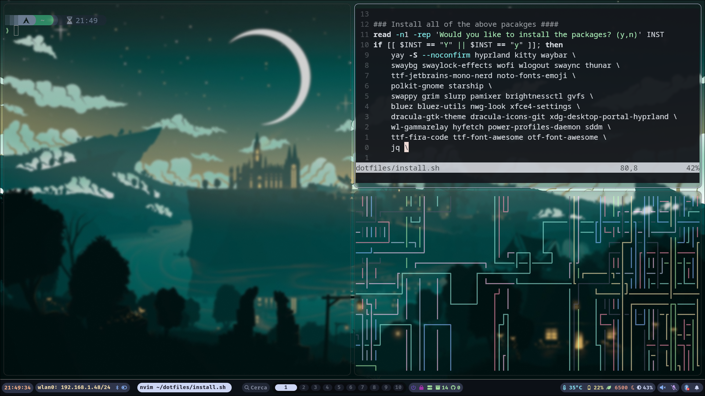

# My dotfiles
...and an installation script for a fresh linux with yay, hyprland and waybar. 



_I like rice, but i prefer pasta_    

> This rice is heavily inspired (copied) from [SolDoesTech](https://github.com/soldoestech)'s hyprland repos, check those if you'd like a probably better tested config. If there are any issues with the [hyprland](https://wiki.hyprland.org/) and [waybar](https://github.com/Alexays/Waybar/wiki/) configuration, before opening an issue, check with the wikis as i have no idea what i'm doing, also don't trust random installation scripts online :). If there are issues with the installation scripts report it here ty. 

# Usage

## Installation

Just copy the configs if you have already built your system, otherwise you can clone the repo and run the installation script. 

## Waybar Modules

### Wake on LAN and Tailscale module
<!-- TODO machine -> host/client or something like that -->
If you'd like to use the waybar module to wake a machine over LAN either follow the instructions in the installation scripts or create the ```./secrets``` folder, the ```ip-address.txt``` and ```mac-address.txt``` files; the same module can be used to ssh into another machine using tailscale, for this create the ```hostname.txt``` file inside the secret folder with the hostname or the ip address in your tailscale network. For simplicity both these functions refer to the same machine. 
You can just comment out or remove the module in [waybar config](./waybar/config.jsonc) if you don't use it. If you haven't configured it, it will not show in waybar. 

To WoL left-click the module, to ssh right-click it; the color of the module shows the tailscale status of the machine you configured, not if the machine itself is on or off. If you have enabled tailscaled on the machine it will show the machine status, as it starts on startup. If you have set different machines for WoL and ssh the tooltip refers only to the ssh machine.

### GitHub Notifications

Instructions in the waybar [wiki](https://github.com/Alexays/Waybar/wiki/Module:-Custom:-Simple#github-notifications). Place the ```notifications.token``` inside the ```.secrets``` folder. 

## Themes

I use [squared theme](https://www.gnome-look.org/p/2206255) for gtk, and [ant-dark](https://store.kde.org/p/1640981/) icons theme. 
Download and unzip theme respectively in ```~/.themes``` and ```~/.local/share/icons```, use this last directory to store cursor icons (i use my oshi [Rin Penrose](https://www.gnome-look.org/p/2260618)'s)

# Requirements

These packages will be installed through the [installation script](install.sh):

<details>
    <summary>Packages</summary>

    - swaybg 
    - swaylock-effects 
    - wofi
    - wlogout
    - swaync
    - thunar
    - ttf-jetbrains-mono-nerd
    - noto-fonts-emoji
    - polkit-gnome 
    - starship
    - swappy
    - grim
    - slurp
    - pamixer
    - brightnessctl
    - gvfs
    - bluez
    - bluez-utils
    - nwg-look
    - xfce4-settings
    - dracula-gtk-theme
    - dracula-icons-git
    - xdg-desktop-portal-hyprland 
    - wl-gammarelay
    - hyfetch
    - power-profiles-daemon
    - sddm
    - ttf-fira-code
    - ttf-font-awesome
    - otf-font-awesome
    - jq
</details>


## Optional

The following packages and programs are optional to install through the installation script, if you choose not to install them change the configs as you see fit. 
 - [wol]
 - [Tailscale](https://wiki.archlinux.org/title/Tailscale)
 - [Telegram](https://wiki.archlinux.org/title/Telegram)
 - [Notion](https://wiki.archlinux.org/title/Notion-app)
 - [Discord](https://wiki.archlinux.org/title/Discord)
 - [Steam](https://wiki.archlinux.org/title/Steam)
 - [Spotify](https://wiki.archlinux.org/title/Spotify)
 - [Chromium](https://wiki.archlinux.org/title/Chromium)
 - [VSCodium](https://wiki.archlinux.org/title/Visual_Studio_Code)

# To-Dos
  - [ ] Working To-Dos
  - [ ] Test the installation script :3 
  - [ ] Add usefull information in the README
  - [ ] Create a version with english toolip in waybar
    - [ ] Add the option to choose which language to use in the installation script
 - [ ] Improve installation script


# Contributions
...and suggestions are welcome, just open an issue or a pull request :)

# See Also

[SolDoesTech](https://github.com/soldoestech)'s hyprland configs, and the [hyprland](https://wiki.hyprland.org/) and [waybar](https://github.com/Alexays/Waybar/wiki/) wikis. 